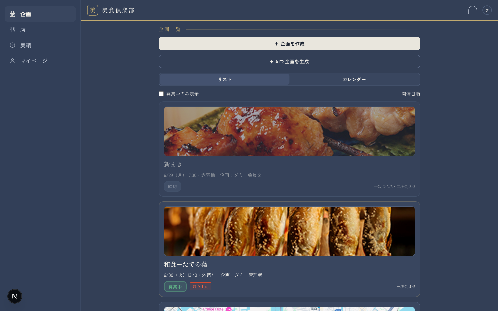
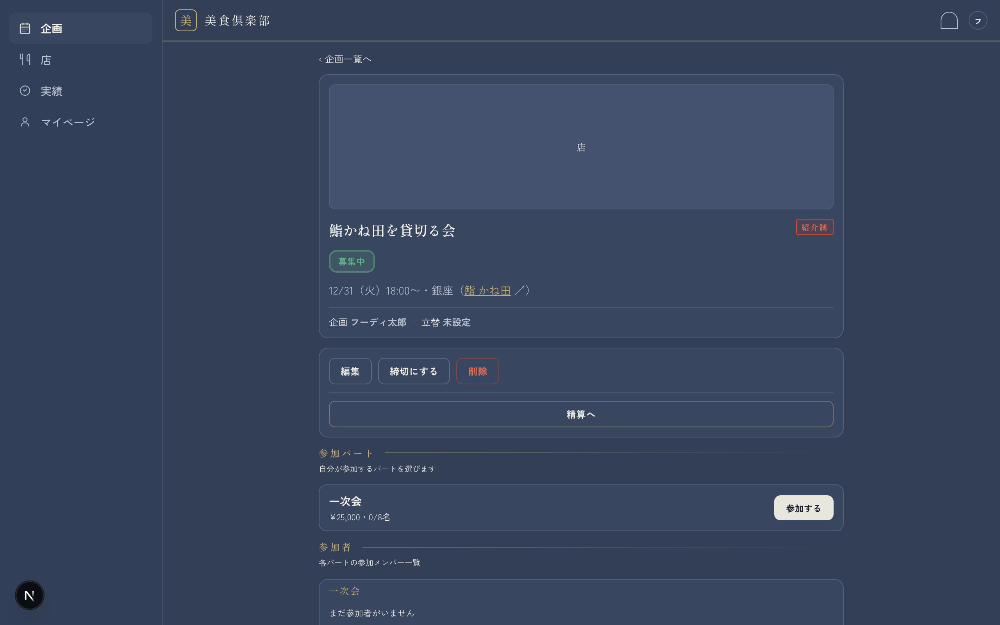
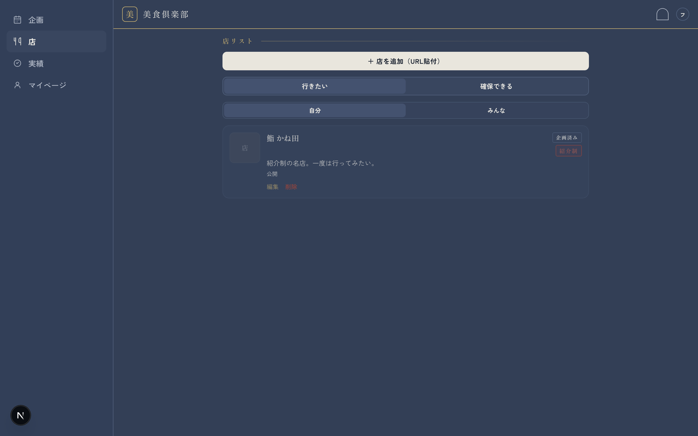
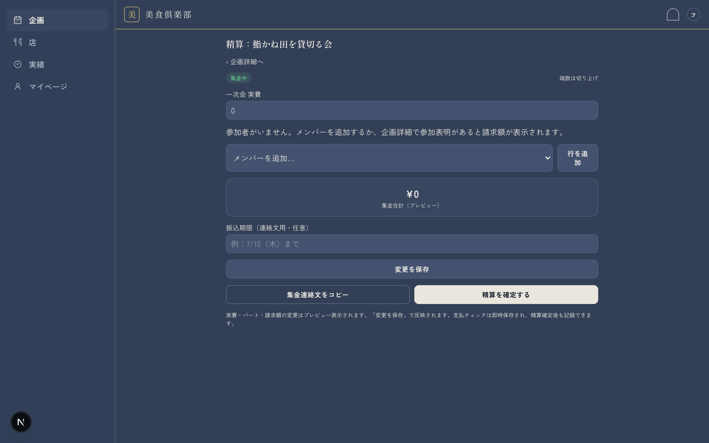
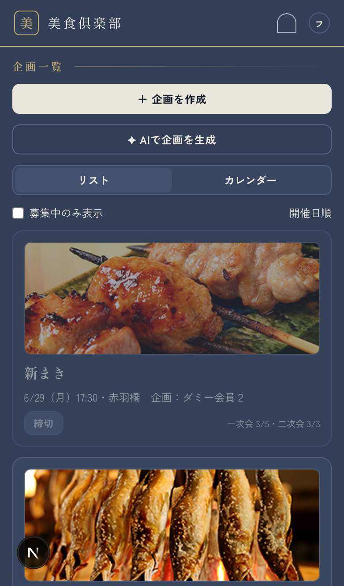

# フーディコミュニティ運営アプリ

食のコミュニティ向け運営アプリ（Next.js + Supabase）。

## このアプリの目的

招待制の食のコミュニティ（フーディコミュニティ）向けに、**企画・募集・精算・体験共有**を一つのアプリでまとめる運営ツールです。

**解決したいこと**


| 対象         | 便益                                |
| ---------- | --------------------------------- |
| 幹事・古参層     | 企画作成・募集管理・集金管理の手間を減らし、運営負荷を下げる    |
| 新規・準新規メンバー | 企画を眺めて低ハードルで参加でき、将来的に企画デビューしやすくする |


**設計上の方針**

- **希少な食体験という価値（排他性）は維持**し、参加の偏りだけを解消する
- 誰でも企画を立てられる権限設計（企画者の固定化を防ぐ）
- 店の希少性（予約難易度タグ・「確保できます」宣言）を可視化し、コネを活かす
- 小規模運用を前提（メンバー 20〜50 名・月間企画 2〜5 件・単一コミュニティ）

**中核フロー**

```
行きたい店ストック / 確保宣言
  → 企画作成（OGP カード・希少バッジ）
  → 募集・パート別参加表明・定員自動締切
  → 自動リマインド（4日前 + 当日）
  → 開催
  → 集金管理（パート別割り勘・未払いチェック）
  →（将来）写真・店情報のアーカイブ化
```

**企画書の課題との対応（MVP でカバーするもの）**


| 課題              | 解決手段                            |
| --------------- | ------------------------------- |
| 企画作成・投稿が手間      | 店リンク → OGP カード自動生成（＋ AI 企画ドラフト） |
| 参加表明・定員管理が手作業   | 参加ボタン＋定員自動締切                    |
| 「いつ・どこ・誰」が分からない | 企画一覧・カレンダー                      |
| 企画ストックの保存場所がない  | 行きたい店ストックリスト                    |
| リマインド・集金連絡が手作業  | 自動リマインド＋集金管理                    |
| 企画者が固定化         | 誰でも投稿可                          |
| 希少性・コネが活きない     | 予約難易度タグ＋確保宣言                    |


※ 参加者の偏り（課題⑨）は機能化せず、運用ルールで対応。

## 機能概要


| 領域    | 主な機能                                   |
| ----- | -------------------------------------- |
| 認証    | メール＋パスワード（登録・ログイン・ログアウト・パスワードリセット）     |
| 企画    | 作成・編集・一覧・カレンダー・参加表明・コメント・AI ドラフト生成・採用  |
| 店     | 行きたいリスト・確保宣言・OGP 取得・エリア/予約難易度・編集/削除    |
| 精算    | パート別割り勘・立替者指定・支払チェック・未払い確認・確定/確定取消     |
| 通知    | 開催 4 日前＋当日のリマインド（アプリ内通知＋メール）           |
| マイページ | プロフィール（ニックネーム・アバター）・参加予定・未払い・ストック・確保宣言 |
| 実績    | 開催済み企画の一覧（`/records`）                  |
| 管理    | コミュニティ設定・メンバー管理・リマインド/メール設定（admin のみ）  |


**主要画面**


| 画面        | パス                                                               |
| --------- | ---------------------------------------------------------------- |
| 企画一覧      | `/events`                                                        |
| 企画詳細・参加   | `/events/[id]`                                                   |
| 企画作成・編集   | `/events/new` · `/events/[id]/edit`                              |
| AI 企画ドラフト | `/events/drafts` · `/events/drafts/new` · `/events/drafts/[id]`  |
| 精算        | `/events/[id]/settlement`                                        |
| 店リスト      | `/shops`                                                         |
| 店詳細       | `/shops/[id]`                                                    |
| マイページ     | `/me`                                                            |
| 実績        | `/records`                                                       |
| 設定（admin） | `/settings` · `/settings/reminders` · `/settings/email-template` |


**ロール**


| ロール        | 概要                         |
| ---------- | -------------------------- |
| メンバー       | 企画閲覧・参加表明・店ストック・自分の支払状況確認  |
| 企画者（幹事）    | 自企画の作成・編集・締切・参加者管理・集金管理    |
| 立替者        | 企画者から指定。割り勘母集団・金額の最終調整     |
| 管理者（admin） | コミュニティ設定・メンバー管理・全企画/店の管理操作 |


## 技術スタック


| レイヤ     | 技術                                                | 備考                                            |
| ------- | ------------------------------------------------- | --------------------------------------------- |
| フロントエンド | Next.js 16（App Router）+ TypeScript + Tailwind CSS | レスポンシブ（モバイル=下部タブ / PC=サイドナビ）                  |
| 認証      | Supabase Auth                                     | メール＋パスワード。email は `auth.users` 管理（非公開）        |
| データベース  | Supabase Postgres + RLS                           | マイグレーション: `supabase/migrations/`              |
| ストレージ   | Supabase Storage                                  | 店画像・アバター・ロゴ等                                  |
| サーバー処理  | Supabase Edge Functions                           | OGP 取得（`ogp-fetch`）・リマインド送信（`send-reminders`） |
| スケジュール  | pg_cron                                           | リマインドの定期実行                                    |
| メール     | Resend                                            | Edge Functions から送信                           |
| AI      | Google Gemini                                     | 企画ドラフト生成（`gemini-3.5-flash`）                  |
| ホスティング  | Vercel                                            | —                                             |
| テスト     | Playwright（E2E）+ Vitest（ユニット）                     | —                                             |
| 運用      | GitHub Actions                                    | Keepalive（3日おき）・週次 DB バックアップ                  |


**ディレクトリ構成（概要）**


| パス               | 内容                              |
| ---------------- | ------------------------------- |
| `src/app`        | App Router のページ                 |
| `src/components` | UI コンポーネント                      |
| `src/lib`        | Supabase クライアント・ビジネスロジック等       |
| `src/types`      | `supabase gen types` で生成する DB 型 |
| `supabase/`      | マイグレーション・Edge Functions         |
| `e2e/`           | Playwright E2E テスト              |


## 各機能の説明

#### 認証

- メール＋パスワードで登録・ログイン・ログアウト・パスワードリセット
- 未ログインでは企画・店の閲覧・操作不可
- 表示名はニックネームのみ。メールアドレスは認証専用で他メンバーからは見えない

#### 企画

- **作成:** 店リンクから OGP（店名・画像・説明）を自動取得。失敗時は手動入力で継続
- **設定:** 開催日時（10 分刻み）、場所、定員、概要、参加パート（一次会・二次会…）を設定
- **募集:** パートごとに参加表明。定員到達で自動締切。締切後の取消は企画者・admin が手動対応
- **一覧:** `/events` でリスト・カレンダー表示。参加者ニックネームも可視化
- **詳細:** コメント投稿、参加者管理、立替者指定、精算への導線
- **AI 生成:** Gemini でコンセプト 3 案 → 1 案選択 → 集客文生成 → 編集・日時入力 → 採用（`/events/drafts`）

#### 店リスト

- **行きたいリスト:** メンバーが「行きたい店」をストック。メモ付き。公開/非公開設定可
- **確保宣言:** 「この店、確保できます」を宣言。コネ種別（常連・紹介ルート等）と条件メモ
- **希少性:** 予約難易度タグ（ふらっと入れる / 予約可 / 紹介制 / 数ヶ月待ち / 会員制）を店に付与
- **企画への導線:** ストック・確保宣言からワンタップで企画作成画面へ
- **編集・削除:** 投稿者はエリア・予約難易度を編集。行きたいリストから削除（有効企画がある店は店データは残る）

#### 精算

- パートごとに `ceil(実費 ÷ 参加者数)` で割り勘（円単位切り上げ）
- 企画者・立替者が母集団・請求額を最終調整。確定後は DB ロック（確定取消で再編集可）
- 参加者は自分の請求額・支払状況を確認。マイページで未払い一覧も表示
- 送金機能なし — 振込先情報の表示と支払チェック管理のみ

#### リマインド

- 企画公開時に開催 **4 日前** と **当日** の 2 回分を自動生成
- pg_cron → Edge Function でアプリ内通知＋メール送信
- 送信時刻・メール件名/本文は admin が設定画面で変更可

#### マイページ（`/me`）

- ニックネーム・アバター編集
- 企画中（精算へ）、参加予定、未払い、ストック・確保宣言、ログアウト

#### 実績（`/records`）

- 開催済み企画の一覧。精算確定と連動

#### 通知ベル

- `notifications` テーブルの実データを表示。企画リンク付き

## 管理者（admin）機能

`profiles.role = 'admin'` のメンバーに付与。設定画面（`/settings`）は admin のみアクセス可（一般ユーザーは `/me` へリダイレクト）。


| 機能        | パス                         | 内容                            |
| --------- | -------------------------- | ----------------------------- |
| コミュニティ設定  | `/settings`                | コミュニティ名・ロゴ・振込先情報の編集           |
| メンバー管理    | `/settings`                | メンバー一覧表示、admin 権限の付与/剥奪       |
| リマインド設定   | `/settings/reminders`      | 4 日前・当日のデフォルト送信時刻             |
| メールテンプレート | `/settings/email-template` | リマインドメールの件名・本文                |
| 企画管理      | `/events/[id]` 等           | 全企画の編集・削除、参加者の手動追加/削除、締切の取り消し |
| 店管理       | `/shops`                   | 全ストックの閲覧・任意投稿の削除（「削除（管理者）」）   |
| 精算        | `/events/[id]/settlement`  | 全企画の精算画面へアクセス、確定/確定取消         |


**一般メンバーとの権限差（主なもの）**


| 操作             | メンバー    | admin |
| -------------- | ------- | ----- |
| コミュニティ設定の変更    | ✕       | ○     |
| admin 権限の付与/剥奪 | ✕       | ○     |
| 他人の企画の編集・削除    | ✕       | ○     |
| 締切後の参加者追加/削除   | ✕       | ○     |
| 他人の店ストック削除     | ✕       | ○     |
| 不適切コメントの削除     | 自分の投稿のみ | 任意の投稿 |


初期 admin は Supabase ダッシュボードで `profiles.role` を手動更新して設定（詳細は本文「初期管理者の設定」参照）。

## スキーマの概要構造

Supabase Postgres。認証は `auth.users`、アプリ側プロフィールは `public.profiles`（1:1）。RLS で権限を DB 層でも強制。

```
auth.users ──1:1── profiles
                        │
    ┌───────────────────┼───────────────────┐
    │                   │                   │
  shops ◄── stocks    events ◄── comments   secure_claims
    │                   │
    │              event_parts
    │                   │
    │              participations
    │                   │
    └──────────► settlements ── settlement_items
                        │
                   reminders / notifications

community_settings（単一レコード）
event_drafts ── draft_shop_candidates（AI 企画ドラフト）
photos（フェーズ2・アルバム）
```

**主要テーブル**


| テーブル                    | 役割                                          |
| ----------------------- | ------------------------------------------- |
| `profiles`              | メンバー（nickname, role, avatar_path）           |
| `community_settings`    | コミュニティ名・ロゴ・振込先・リマインド設定                      |
| `shops`                 | 店マスタ（OGP・エリア・予約難易度）                         |
| `stocks`                | 行きたい店ストック（memo, is_private）                 |
| `secure_claims`         | 確保宣言（コネ種別・条件メモ）                             |
| `events`                | 企画（status: open / closed / held / archived） |
| `event_parts`           | 参加パート（定員・想定費用）                              |
| `participations`        | パート別参加表明                                    |
| `settlements`           | 精算（1 企画 1 精算、立替者、パート別実費）                    |
| `settlement_items`      | 参加者ごとの請求額・支払状況                              |
| `reminders`             | リマインド送信スケジュール                               |
| `notifications`         | アプリ内通知                                      |
| `comments`              | 企画コメント                                      |
| `event_drafts`          | AI 生成企画ドラフト                                 |
| `draft_shop_candidates` | ドラフトの候補店                                    |
| `photos`                | アルバム写真（フェーズ2）                               |


**設計上の要点**

- `profiles` に email を持たず、`auth.users` 側で非公開を担保
- `settlements.event_id` に unique 制約（1 企画 1 精算）
- `events.deleted_at` で論理削除（参加・精算データは保持）
- 精算確定後は `settlement_items` を DB トリガでロック

詳細 DDL: `Requirements-docs_and_Design/schema.sql`、マイグレーション: `supabase/migrations/`。

## 画面イメージ

### 企画一覧（PC）



### 企画詳細



### 店リスト



### 精算



### 企画一覧（モバイル）



## 実装進捗


| フェーズ | 内容                                     | 状態                                 |
| ---- | -------------------------------------- | ---------------------------------- |
| 0–5  | 基盤・認証・店・企画                             | ✅                                  |
| 6    | 精算（S09）                                | ✅ 2026-06-16                       |
| 7    | リマインド・運用                               | ✅ 2026-06-20                       |
| 8    | マイページ・設定・仕上げ                           | ✅ 部分 2026-06-21                    |
| 9    | UIブラッシュアップ（ナビ・設定拡張・リマインド4日前・開催日時）      | ✅ 2026-06-21                       |
| 10   | 機能ブラッシュアップ（ルーティング整理・実績・店メモ・企画UI）       | ✅ 2026-06-21（ルーティング簡素化 2026-06-22） |
| 11   | 機能ブラッシュアップ #3（参加者管理・立替者・S05 UI・締切戻し）   | ✅ 2026-06-21                       |
| 12   | 機能ブラッシュアップ #4（店UI・行きたいメモ・アイコン・マイページUI） | ✅ 2026-06-21                       |
| 13   | 追補（店公開/精算/実績/未払い）                      | ✅ 2026-06-24〜28                    |
| 14   | 店リスト編集・削除（エリア/予約難易度・管理者全件削除）           | ✅ 2026-06-28                       |
| 15   | AI企画自動生成（ドラフト → 採用）                    | ✅ 2026-06-28                       |


詳細は `Requirements-docs_and_Design/cursor_implementation_plan_v1.0.md` を参照。`implementation_spec.md` §8–§17（フェーズ6–15）。

## 実装予定の機能

`Requirements-docs_and_Design/requirements_v1.1.md` に基づくロードマップ。MVP（§4.1）はフェーズ 0–15 で概ね完了。以下はこれから着手・検討する項目。

### 本番前タスク（残課題）


| 項目          | 内容                                                            |
| ----------- | ------------------------------------------------------------- |
| Vercel デプロイ | 本番ホスティング（P8-6・人間作業）                                           |
| E2E 網羅      | 要件定義の全 AC を Playwright でカバー（P8-7）                             |
| Resend      | 送信ドメイン認証                                                      |
| 環境変数        | `APP_URL` の本番 URL 化                                           |
| DB          | 未適用 migration があれば `npx supabase db push`（`20260628110036` 等） |


### フェーズ2 — あったら良い（背骨完成後）


| 機能           | 概要                                                 |
| ------------ | -------------------------------------------------- |
| 開催後アルバム      | 写真投稿（Supabase Storage）・店情報の蓄積                      |
| ウェイトリスト      | 定員到達後の参加待ち登録。キャンセル時の自動繰り上げ＋通知                      |
| 非金銭評価        | 企画数の可視化・トロフィー（企画者固定化の解消を支援）                        |
| 古参のお墨付きコメント  | 希少性・店情報の信頼性を高めるコメント機能                              |
| 過去企画アーカイブ・統計 | 振り返り・ダッシュボード（開催件数/参加人数の推移、企画者ランキング、行った店マップ・ジャンル分布） |
| 領収書発行補助      | 精算後の領収書作成支援                                        |
| メンバー紹介・招待管理  | 招待制文化の受け皿（機能化の方向性は未確定）                             |


※ **AI 企画紹介文生成**は要件上フェーズ2だったが、フェーズ15（`/events/drafts`）として先行実装済み。

### 将来検討


| 機能          | 概要                                                            |
| ----------- | ------------------------------------------------------------- |
| LINE 連携     | 通知・企画投稿への連携                                                   |
| 汎用化         | 他コミュニティへの展開                                                   |
| フリーミアム      | 効率化（高度 AI・一括管理・自動化）と高度化（BI/分析・店マップ）を課金軸。希少情報の限定公開は無料側の価値として維持 |
| 招待管理の機能化    | 招待制・ニックネーム文化を前提に方向性を検討                                        |
| LINE ミニアプリ化 | スコープ外として将来検討                                                  |


### スコープ外（実装しない）

- アプリ内決済・送金（集金は計算・管理のみ。振込は手動）
- 招待制ロジックの MVP 実装（文化としては維持）
- 完全オープン化

## ディレクトリ構成

`src/app` に App Router のページ、`src/components` に UI コンポーネント、`src/lib` に Supabase クライアント等のユーティリティ、`src/types` に `supabase gen types` で生成する DB 型、`supabase/` にマイグレーションと Edge Functions、`e2e/` に Playwright E2E テストを配置する。

## セットアップ

```bash
npm install
cp .env.example .env.local
# .env.local に Supabase の URL と anon key を設定
npm run dev
```

Supabase プロジェクト「Foodie-Community-App」（東京リージョン）のダッシュボード → Settings → API から `NEXT_PUBLIC_SUPABASE_URL` と `NEXT_PUBLIC_SUPABASE_ANON_KEY` を取得してください。

### AI企画生成（Gemini）

2段階でコンセプト → 集客文を生成し、編集・日時入力後に `events` へ採用する。生成物は `event_drafts` に隔離（既存 `events` ロジックは採用時のみ）。

**フロー:** 条件入力 → コンセプト3案 → 1案選択 → 集客文生成 → 編集 → 日時入力 → 採用

**候補店の指定（いずれか／併用可）:**

- 店リストから選択（最大20件）
- 店リンク URL（OGP 取得 → `shops` 登録/再利用）
- 起点: ストック / 確保宣言 / フリー検索

**制約:** 店は DB 候補の `shop_id` のみ。`held_at` はユーザー入力。Gemini 呼び出しはサーバー専用（`src/lib/gemini.ts`）。

**主要パス:** `/events/drafts/new` · API `/api/drafts/`* · migration `20250628130000_event_drafts.sql`

**環境変数** `GEMINI_API_KEY`（クライアント非公開）:

```bash
# .env.local
GEMINI_API_KEY=your-google-ai-api-key
```

Vercel でも同名を Production 等に設定し、**追加・変更後は再デploy 必須**。キー取得: [Google AI Studio](https://aistudio.google.com/apikey)

マイグレーション適用後: `npm run gen:types`

E2E: `e2e/drafts.spec.ts`

### Supabase Auth の URL 設定（これだけ設定すればOK）

Authentication → URL Configuration:

- **Site URL**: `http://localhost:3000`（本番デプロイ時は本番 URL）
- **Redirect URLs** に以下を追加:
  - `http://localhost:3000/`**
  - 本番デプロイ時は `https://<本番ドメイン>/**`

メール本文（テンプレート）の変更は不要。既定の `{{ .ConfirmationURL }}` のままでよい。

### パスワードリセットのフローについて（クロスブラウザ対応）

　owType: "implicit" `のクライアントを使い、`#access_token=...&type=recovery `を ハッシュで返す方式にしている（`code_verifier`不要のため別ブラウザ/別端末でも成立）。`redirectTo`は`/reset/update `を直接指し、`reset/update`ページがハッシュの トークンで`setSession` してから新パスワードを設定する。

> アプリ本体（ログイン・新規登録）は従来どおり PKCE（cookie ベース）のまま。
> implicit を使うのはパスワードリセットのメール送信時だけに限定している。

## 開発

```bash
npm run dev      # http://localhost:3000
npm run lint
npx playwright test
```

## データベース

マイグレーションは `supabase/migrations/` に配置済み。リモートへの適用:

```bash
npx supabase login
npx supabase link --project-ref nzrawtaclloafhkgoeuc
npx supabase db push
```

型の再生成: `npm run gen:types`（要 `supabase login`）

### Storage バケット

`shop-images`（公開）/ `community`（公開・admin書込）/ `event-photos`（認証必須）/ `**avatars`（公開読取・本人フォルダ書込）** は
`supabase/migrations/20250616000000_storage.sql` および `**20250625000001_profile_avatars.sql`** で定義済み。画像上限は **15MB**。

### Edge Function: ogp-fetch

`supabase/functions/ogp-fetch` をデプロイ済み。店追加モーダルから呼び出し、
OGP（title / image / description）を取得する。失敗時は手動入力にフォールバック。

ローカルで関数を試す場合:

```bash
npx supabase functions serve ogp-fetch
```

### Edge Function: send-reminders（フェーズ7・完成）

企画リマインドを送信するバッチ関数。**開催4日前 + 当日**の2回（時刻は `community_settings` 参照）。
`remind_at <= now()` かつ `sent_at is null` のリマインドに対し、参加者へ **アプリ内通知 + Resend メール** を送り `sent_at` を更新する。
二重実行時は `sent_at` の楽観ロックで再送を防ぐ（冪等）。メール件名/本文は DB テンプレートまたはデフォルト HTML を使用。

**テスト送信**: POST body `{ "test_email": "your@email.com" }`（任意 `event_id`）

**実装ファイル**: `supabase/functions/send-reminders/`、`supabase/migrations/20250616000009_notifications.sql`

**フロント**: 通知ベルは `notifications` テーブルの実データを表示（`NotificationBell` / `getNotifications`）

#### ⚑ 初回セットアップ（人間が行う）

1. **Resend**（[https://resend.com）でアカウント作成・APIキー発行](https://resend.com）でアカウント作成・APIキー発行)
  - 検証前は `onboarding@resend.dev` から送信可（Resend に登録したメールアドレス宛のみ）
  - 本番は独自ドメインを Resend に追加
2. **Supabase → Edge Functions → Secrets** に以下を登録:


| Secret              | 値                                                              |
| ------------------- | -------------------------------------------------------------- |
| `RESEND_API_KEY`    | Resend の API キー                                                |
| `RESEND_FROM_EMAIL` | 例: `Foodie Community <onboarding@resend.dev>`                  |
| `APP_URL`           | 本番 URL（例: `https://your-app.vercel.app`）                       |
| `CRON_SECRET`       | ランダム文字列（`openssl rand -hex 32` で生成。**名前は `CRON_SECRET` 完全一致**） |
| `APP_URL`           | ローカル: `http://localhost:3000` / 本番: Vercel URL                 |


`SUPABASE_SERVICE_ROLE_KEY` はデプロイ時に自動注入される。フロントの `.env.local` には置かない。

1. **関数デプロイ**

```bash
npx supabase functions deploy send-reminders
```

1. **手動テスト**（`CRON_SECRET` をヘッダに付与）

```bash
curl -X POST "https://nzrawtaclloafhkgoeuc.supabase.co/functions/v1/send-reminders" \
  -H "Content-Type: application/json" \
  -H "x-cron-secret: <CRON_SECRET>"
```

1. **pg_cron 用 Vault シークレット**（SQL Editor・2件とも登録）

```sql
select vault.create_secret(
  'https://nzrawtaclloafhkgoeuc.supabase.co/functions/v1/send-reminders',
  'send_reminders_function_url'
);
select vault.create_secret('<CRON_SECRETと同じ値>', 'send_reminders_cron_secret');
```

1. **マイグレーション適用**（未適用の場合）

```bash
npx supabase db push
```

マイグレーション `20250616000010_send_reminders_cron.sql` 適用後、
`cron.job` で `send-reminders-hourly`（`0 * * * *` = 毎時0分 UTC = JST 毎時 :00）が登録される。

確認: `select jobname, schedule, active from cron.job;`

### GitHub Actions（運用・フェーズ7 完成）

リポジトリ Secrets（`**.env.local` だけではバックアップ不可**）:


| Secret                  | 用途        | 値の取り方                                                                                          |
| ----------------------- | --------- | ---------------------------------------------------------------------------------------------- |
| `SUPABASE_URL`          | Keepalive | `.env.local` の `NEXT_PUBLIC_SUPABASE_URL`                                                      |
| `SUPABASE_ANON_KEY`     | Keepalive | `.env.local` の `NEXT_PUBLIC_SUPABASE_ANON_KEY`                                                 |
| `SUPABASE_ACCESS_TOKEN` | バックアップ    | [https://supabase.com/dashboard/account/tokens](https://supabase.com/dashboard/account/tokens) |
| `SUPABASE_DB_PASSWORD`  | バックアップ    | Database → **Settings** → Reset database password（再表示不可）                                       |


| ワークフロー                   | 内容             | 保存先                         |
| ------------------------ | -------------- | --------------------------- |
| `supabase-keepalive.yml` | 3日おき REST ping | —                           |
| `supabase-backup.yml`    | 週次 DB ダンプ      | GitHub **Artifacts**（30日保持） |


Artifacts の見方: Actions → 成功した **Supabase Weekly Backup** → 下部 **Artifacts** → Download

いずれも `workflow_dispatch` で手動実行可能（2026-06-20 手動実行成功確認済）。

**本番前**: Resend 独自ドメイン認証（テスト中は登録メール宛のみ送信可）。

### 初期管理者の設定（手動）

1. アプリから通常登録する
2. Supabase ダッシュボード → SQL Editor で実行:

```sql
UPDATE public.profiles
SET role = 'admin'
WHERE id = (
  SELECT id FROM auth.users WHERE email = 'あなたのメール@example.com'
);
```

1. 再ログイン後、管理者権限が反映される

## フェーズ8–9: マイページ・設定・UIブラッシュアップ（2026-06-21）

### マイページ `/me`

- ニックネーム編集、企画中（精算へ）、参加予定、未払い、ストック・確保宣言、ログアウト

### ナビ

- 企画 / 店 / マイページ / **設定**（admin のみ）。アイコン付き
- 企画作成は企画一覧 `/events` 内「＋ 企画を作成」ボタン、または「✦ AIで企画を生成」

### 設定 `/settings`（admin のみ）


| パス                         | 内容                                          |
| -------------------------- | ------------------------------------------- |
| `/settings`                | コミュニティ名・ロゴ・振込先、メンバー一覧（UUID 表示）+ admin 付与/剥奪 |
| `/settings/reminders`      | 4日前・当日リマインドのデフォルト送信時刻                       |
| `/settings/email-template` | リマインドメール件名/本文テンプレ                           |


非 admin は `proxy.ts` で `/me` へリダイレクト

### 企画作成の開催日時

- 開催日（date）+ 開催時刻（select、10分刻み 00:00〜23:50）

### マイグレーション（未適用の場合）

```bash
npx supabase db push
```

追加 migration: `20250622000001_community_reminder_email_settings.sql`, `20250622000002_reminder_advance_four_days.sql`

### E2E

```bash
npx playwright test          # auth / shops / events / settlement / me
npx playwright test me auth  # フェーズ8 重点
```

### 本番前の残タスク

- **P8-6**: Vercel デプロイ（環境変数 + Auth Redirect URLs）
- **P8-7**: 要件定義 §4.1 全 AC の Playwright 網羅
- Resend 独自ドメイン認証、`APP_URL` 本番化

## フェーズ10–12: 機能ブラッシュアップ（2026-06-21）

### フェーズ10（概要）

- `/` は `/events` へリダイレクト（ログイン後の初期画面は企画一覧）。実績 `/records`
- 店メモ、企画一覧残数バッジ、参加取消ロジック修正、精算確定と実績連動
- 詳細: `implementation_spec.md` §12

### フェーズ11 機能ブラッシュアップ #3


| 区分       | 内容                                                                                      |
| -------- | --------------------------------------------------------------------------------------- |
| 参加者の手動管理 | 企画者・admin が S05 で参加者を追加・削除（`open` / `closed`）。定員超過は不可                                   |
| 立替者の指定   | 企画者・admin が一次会参加者から `set_event_finalizer` RPC で指定。参加者一覧の下に配置                            |
| 精算アクセス   | 企画者・admin・立替者が精算画面にアクセス（`canAccessSettlementPage`）                                      |
| 締切の取り消し  | `closed` → `open`「募集中に戻す」（企画者・admin。`held` は不可）                                         |
| S05 UI   | 参加パート（アクション行）／参加者（名簿カード）／立替者（真鍮左線パネル）で視覚分離                                              |
| 会費見込み    | 参加表明済み全員（企画者含む）。コンパクト表示（`text-lg`）                                                      |
| 一覧残数     | 一次会残り **0人** は「満員」表示                                                                    |
| 削除ボタン    | `Button` の `danger` バリアント（朱色）。企画削除・コメント削除等                                              |
| DB       | `20250624000001_set_event_finalizer.sql`（`set_event_finalizer`, `ensure_settlement` 更新） |


### フェーズ12 機能ブラッシュアップ #4


| 区分           | 内容                                                                    |
| ------------ | --------------------------------------------------------------------- |
| 店リスト S07 UI  | 「＋ 店を追加」を企画一覧と同様 **上部 primary 全幅**ボタンに統一（`ShopsPageClient`）           |
| 行きたいメモ       | `stocks.memo` を店追加モーダル・S08 店詳細で入力・編集。S07 一覧・マイページは表示のみ                |
| プロフィールアイコン   | `profiles.avatar_path` + Storage `avatars`。マイページで変更・削除。未設定時はニックネーム頭文字 |
| `UserAvatar` | ヘッダー・企画詳細（参加者/コメント）・店（確保宣言）・マイページで共通表示                                |
| マイページ UI     | ニックネーム編集時は入力欄を全幅配置。アイコンとテキストの重なり防止（grid レイアウト）                        |
| DB           | `20250625000001_profile_avatars.sql`                                  |
| E2E          | `shops.spec.ts` — 店追加時の行きたいメモ入力・詳細表示を確認                               |


### フェーズ13 追補（2026-06-24〜28）


| 区分            | 内容                                                                                      |
| ------------- | --------------------------------------------------------------------------------------- |
| 店 S07         | タブ「行きたい／確保できる」。行きたい内に「自分／みんな」（admin は「全員」）。`stocks.is_private` で公開/非公開。企画済み店は「企画済み」バッジ  |
| 精算 S09        | 確定後も支払チェック可（`20250626000003`）。参加者追加時に明細を再同期（`settlementItemsNeedSync`）                  |
| 実績 `/records` | `events.status = held` で一覧（settlements 結合を廃止）。DB トリガで確定/取消と status 同期（`20250628000001`） |
| マイページ未払い      | 一般ユーザー向け RPC `get_my_unpaid_items`（`20260628110036`）。`settlements` RLS 回避               |


### フェーズ14 店リスト編集・削除（2026-06-28）


| 区分        | 内容                                                                          |
| --------- | --------------------------------------------------------------------------- |
| 店情報編集     | 投稿者は S07「自分」一覧・S08 で **エリア**・**予約難易度**を編集（`ShopEditModal`）                  |
| 削除（一般）    | 行きたいリスト（`stocks`）から削除。投稿者かつ有効企画なしなら `shops` も削除                             |
| 削除（admin） | 「全員」タブで非公開投稿を含む全ストックを表示。「削除（管理者）」で任意の投稿を削除                                  |
| 実装        | `shop-actions.ts`, `getAllStocksExcept()`, `ShopEditModal`, `ShopStockCard` |
| DB        | `20250628120000_shops_delete_creator.sql`                                   |
| E2E       | `shops.spec.ts` — 編集・削除フロー                                                  |


### フェーズ15 AI企画自動生成（2026-06-28）


| 区分  | 内容                                                                                    |
| --- | ------------------------------------------------------------------------------------- |
| UI  | `/events/drafts` 一覧 · `/events/drafts/new` 生成 · `/events/drafts/[id]` 選択/編集/採用        |
| 候補店 | 店リスト複数選択 · URL（OGP） · ストック/コネ/フリー                                                     |
| API | `POST generate-concepts` · `POST generate-detail` · `PATCH` · `POST adopt` · `DELETE` |
| DB  | `event_drafts`, `draft_shop_candidates`, RPC `adopt_event_draft`                      |
| LLM | `gemini-3.5-flash` · 1日20回/ユーザー · `GEMINI_API_KEY`                                    |


### マイグレーション（未適用の場合）

```bash
npx supabase db push
```

未適用の例: `20250624000001` / `**20250625000001**` / `20250626000001`〜`03` / `20250628000001` / `**20250628130000**` / `20260628110036`

### マイグレーション履歴が食い違う場合

リモートにローカルにない ID（ダッシュボード等で適用した場合）があると `db push` が失敗する。`supabase migration list` で Local / Remote を確認し、スキーマが既に反映済みなら `migration repair` で履歴を揃える（2026-06-21 対応例: リモート専用 `20260621*` を reverted、ローカル `20250622*`〜`20250624*` を applied）。